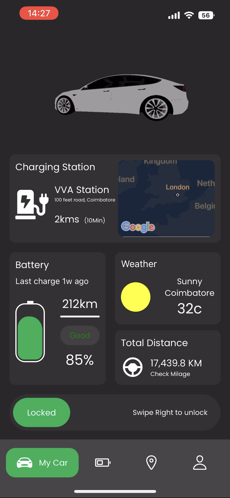
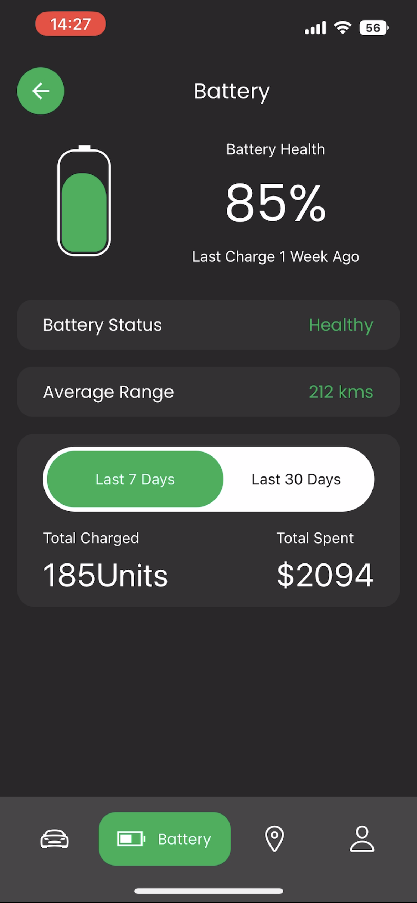
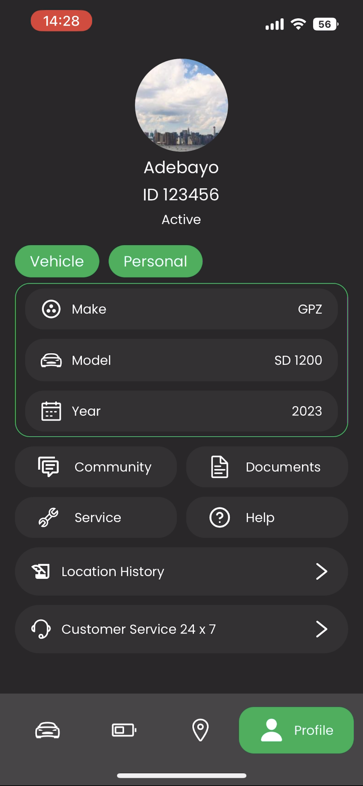

# **Car Management App**

This is a react native mobile application that allows users manage their electric vehicles.

## Here's the result

https://github.com/Olowodev/car-app/assets/99045599/2660c0d0-0cbc-4463-8ed4-eec9d15a120a

 

## Static shots of the app screens

 

### Features

- Users are able to lock and unlock their electric vehicle using the app
- It renders a 3d version of their vehice on the home page
- It has a built in map and directions system used to locate nearest charging stations
- It has a screen for monitoring the battery of the vehicle
- It is also able to give weather updates

### Stack used

- React Native
- Expo
- TypeScript
- Google maps
- ThreeJs
